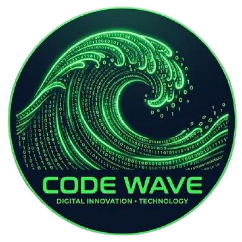

# STEAM ROBOT - API 1° Semestre ADS

  

## 🎯 Desafio

O desafio consiste em desenvolver um chatbot no Telegram que tem como objetivo sanar dúvidas de novos desenvolvedores de jogos da Steam, a fim de facilitar para que eles saibam exatamente quais prioridades devem ter na criação de seus jogos e até mesmo qual é o momento ideal para lançá-los.

## 💡 Solução

Com o Steam Robot, os usuários poderão escolher uma das opções fornecidas pelo chatbot, conseguindo assim um grande leque de conteúdos para facilitar a criação de seu projeto, podendo até mesmo comparar algumas informações e jogos para saber, de forma precisa, qual caminho devem seguir ao criar seu jogo.

## 📖 Backlog do Produto

| Rank | Prioridade | User Stories | Story Points | Sprint |
|---:|:---:|---|---:|:---:|
| 1 | Alta | Como desenvolvedor, quero saber quais os gêneros de jogos mais populares no momento para preparar o meu jogo pro mercado. | 3 | 1 |
| 2 | Alta | Como desenvolvedor, quero saber a faixa de preço média que jogadores estão dispostos a partir com. Para precificar meu jogo apropriadamente. | 5 | 1 |
| 3 | Alta | Como desenvolvedor, quero saber quais os países mais compram jogos da Storefront para preparar o idioma ideal de consumo. | 8 | 1 |
| 4 | Alta | Como desenvolvedor, quero saber os Sistemas operacionais mais populares dos jogadores. Para abranger o maior número de jogadores | 5 | 2 |
| 5 | Médio | Como desenvolvedor, busco saber as épocas com maior número de vendas. Para fazer marketing nessa época | 3 | 2 |
| 6 | Médio | Como desenvolvedor, busco saber a faixa etária que mais compra jogos. Para poder ter um público alvo maior. | 5 | 2 |
7 | Médio | Como desenvolvedor, gostaria de saber a % de jogadores em potencial que usam controle. Para preparar o jogo para adaptabilidade caso necessário. | 3 | 2
8 | Médio | Como desenvolvedor, gostaria de facilmente encontrar o número de jogadores de uma categoria específica, para ter uma ideia de mercado disponível. | 5 | 2
9 | Médio | Como desenvolvedor, quero uma ferramenta que permita que eu veja a minha margem de lucro real de forma rápida, fácil e escalonável. Para ver a viabilidade de meus preços. | 8 | 2
10 | Baixo | Como desenvolvedor, quero facilmente conseguir visualizar o hardware que meu público-alvo é mais provável de ter. Para criar um jogo que eles possam rodar. | 8 | 3
11 | Baixo | Como desenvolvedor, gostaria de visualizar e comparar a diferença entre a ideia de Jogo A e Jogo B. Para poder fazer uma decisão informada na escolha de projeto. | 40 | 3
12 | Baixo | Como desenvolvedor, busco uma ferramenta que agilize o meu processo de priorização baseado em minhas necessidades. Para eu não perder tempo em sistemas desnecessários. | 40 | 3
13 | Baixo | Como desenvolvedor, quero uma ferramenta para correlacionar as coisas em comum que todos os jogos bem-sucedidos têm. Para ter uma ideia do que eles estão fazendo de certo. | 20 | 3

## 🥈 DoR - Definition of Ready
* User Stories com **Critérios de Aceitação**
* Foi estimada pela equipe

## 🥇 DoD - Definition of Done
* Código completo
* Manual do Usuário 

## 📆 Cronograma das Sprints

| Sprint          |    Duração   | Documentação                                     |
| --------------- | :-----------: | ------------------------------------------------ |
| **SPRINT 1** | 07/09 - 27/09 | [Documentação Sprint 1](https://github.com/Code-Wave-ADS/CodeWave/blob/main/docs/MVP/sprint%201) |
| **SPRINT 2** | 05/10 - 25/10 | [Documentação Sprint 2](https://github.com/Code-Wave-ADS/CodeWave/blob/main/docs/MVP/sprint%202) |
| **SPRINT 3** | 02/11 - 22/11 | [Documentação Sprint 3](https://github.com/Code-Wave-ADS/CodeWave/blob/main/docs/MVP/sprint%203) |

## 📕 Manual de instalação

## 🤖 Tecnologias
- Python 3.14+ ([Download](https://www.python.org/downloads/))

## 🧠 Equipe

  <table>
    <tr>
      <th>Membro</th>
      <th>Cargo</th>
      <th>Github</th>
      <th>Linkedin</th>
    </tr>
    <tr>
      <td>Endrew Freire</td>
      <td>Scrum Master</td>
      <td></td>
      <td><a href = "https://www.linkedin.com/in/endrew-vieira-484a68341/?lipi=urn%3Ali%3Apage%3Ap_mwlite_search_srp_all%3B54%2BCFkCvS8SIgdnMLmTTZg%3D%3D"></td>
    </tr>
      <tr>
      <td>Flavio Kenji </td>
      <td>Scrum Team</td>
      <td></td>
      <td><a href = "https://www.linkedin.com/in/flávio-kenji?utm_source=share_via&utm_content=profile&utm_medium=member_android"></td>
    </tr>
      <tr>
      <td> Isabella Silva</td>
      <td>Scrum Team</td>
      <td></td>
      <td><a href = " https://www.linkedin.com/in/isabella-silva-79b971246?utm_source=share_via&utm_content=profile&utm_medium=member_ios"></td>
    </tr>
      <tr>
      <td>Joao Pedro</td>
      <td>Scrum Team</td>
      <td></td>
      <td><a href = " https://www.linkedin.com/in/joão-pedro-araújo-alves-de-almeida-488034408?utm_source=share_via&utm_content=profile&utm_medium=member_ios"></td>
    </tr>
      <tr>
      <td>Kaiane Almeida</td>
      <td>Scrum Team</td>
      <td></td>
      <td><a href = "https://www.linkedin.com/in/kaiane-almeida-maciel-6177aa423?utm_source=share_via&utm_content=profile&utm_medium=member_android"></td>
    </tr>
      <tr>
      <td>Lais Goulart</td>
      <td>Scrum Team</td>
      <td></td>
      <td><a href = "https://www.linkedin.com/in/endrew-vieira-484a68341/?lipi=urn%3Ali%3Apage%3Ap_mwlite_search_srp_all%3B54%2BCFkCvS8SIgdnMLmTTZg%3D%3D"></td>
    </tr>
    <tr>
      <td>Lucas Borba </td>
      <td>Scrum Team</td>
      <td></td>
      <td><a href = "https://www.linkedin.com/in/lucas-borba-132239358/"></td>
    </tr>
      <tr>
      <td>Luiz Pedro</td>
      <td>Scrum Team</td>
      <td></td>
      <td><a href = "https://www.linkedin.com/in/endrew-vieira-484a68341/?lipi=urn%3Ali%3Apage%3Ap_mwlite_search_srp_all%3B54%2BCFkCvS8SIgdnMLmTTZg%3D%3D"></td>
    </tr>
      <tr>
      <td>Mathias Lopes</td>
      <td>Scrum Team</td>
      <td></td>
      <td><a href = "https://www.linkedin.com/in/mathias-a-6067033aa?utm_source=share_via&utm_content=profile&utm_medium=member_android"></td>
    </tr>
      <tr>
      <td>Pedro Noronha</td>
      <td>Product Owner</td>
      <td></td>
      <td><a href = "https://www.linkedin.com/in/pedro-noronha-dias-chaves-9a7715181?trk=contact-info"></td>
    </tr>
  </table>

